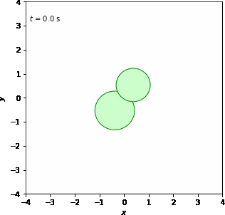

# Result (Translational and Rotational in -xyz axis)

To see illustrations<a href="https://docs.google.com/document/d/1sPUEbgdDKk0lN3tvGKjdI0X0MHleW4hW2XIJrxzFCg0/edit?usp=sharing" target="_blank"> click here</a>

<table>
    <tr>
        <td>
             
            
            
 X-axis Translational XYZ-axis Rotational

        </td>
        <td>
             
            
            
 Y-axis Translational XYZ-axis Rotational

        </td>
        <td>
             
            
            
 Z-axis Translational XYZ-axis Rotational

        </td>
        <td>
             
            
            
 XY-axis Translational XYZ-axis Rotational

        </td>
    </tr>
    <tr>
        <td>
             
            
            
 XZ-axis Translational XYZ-axis Rotational

        </td>
        <td>
             
            
            
 YZ-axis Translational XYZ-axis Rotational

        </td>
        <td>
             
            
            
 XYZ-axis Translational XYZ-axis Rotational

        </td>
    </tr>
</table> 