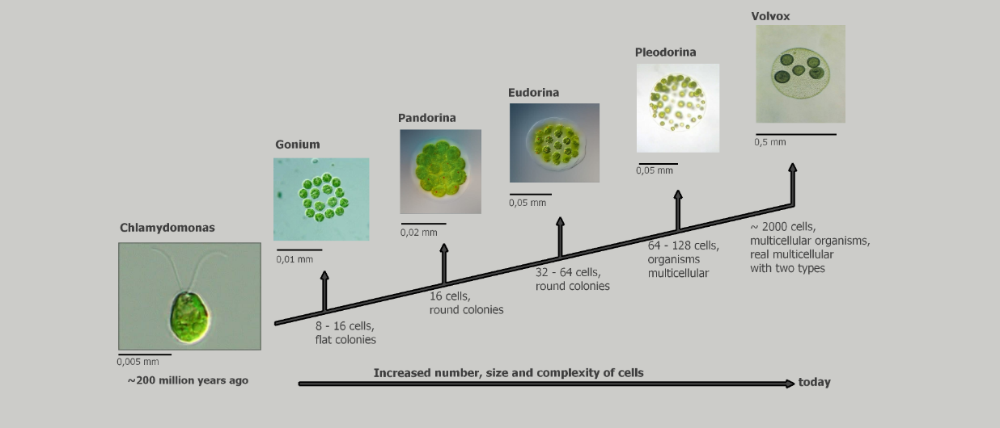
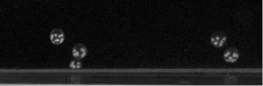

# Binary Volvox Colonies Visualisation

Sevi Nurafni (20920001)
Sparisoma Viridi

# Introduction

 The use of Internet to aid research practice has become more popular in the recent years[1], one of them is through the Youtube platform. YouTube videos are a treasure trove of data that can be used in a variety of research fields, from STEM education to medicine [10]. In this work, to analyze the Volvox motion mode, an observation video is needed. The keyword used is Volvox Globator so find videos on Craig Smith's youtube channel [11]. Volvox globator video can be seen in Figure 1.

<table cellpadding="0" cellspacing="0" border="0" width="100%">
<tr>
  <td align="center">
    
  </td>
</tr>
</table>

 Figure 1. Volvox Globator [11].

Volvox is a genus of spherical green algae composed of thousands of cells [8] moving with flagella. These multicellular organisms consist of 500-50,000 cells [9] of which 98% are somatic cells and the rest are gametes [6]. Volvocine green algae, ranging from unicellular Chlamydomonas to multicellular Volvox can be seen in Figure 1, have emerged as model organisms for a number of problems in biological fluid dynamics [5]. 
 

 Figure 2. Evolution from unicellular to multicellular.

 Drescher (2009) report that when two adjacent Volvox carteri colonies, they can "dance" and move together in two formations, namely the waltz and the minuet. The two Volvox colonies cannot attached each other because the motion of the flagella of each colony produces a vortex [7]. Observation and simulation videos of Volvox carteri colonies can be seen in Figure 2. This behavior is different from Volvox Globator, in the video observation, it can be seen that two colonies of Volvox globator can attached each other and move together. Based on the discovery of this observation video, the idea emerged to create dynamic animation to visualize the approximate results of motion and position varying with time of the motion mode of two attached Volvox colonies.

<table style="width:100%">
  <tr>
    <th>
        
        
 a)

    </th>
    <th>
        
        
 b)

    </th>
  </tr>
</table>

 Figure 3. a) Video observation and b) Video simulation (Ishikawa et al., 2020)

 Volvox colonie with a diameter of 10 𝜇𝑚 to tens of millimeters[8] can be categorized as granular material [3]. The motion of two granular particles can be investigated using simple mechanics, a two-body system [2]. Consider the relative motion of a pair of three-dimensional particles that share the same point of contact. This contact interaction produces pure translational and rotational modes of motion (rolling and twisting) as well as a combination of pure motion. 

