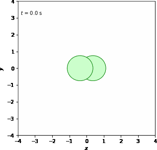

# Temporary Result 20/64

To see illustrations<a href="https://docs.google.com/document/d/1sPUEbgdDKk0lN3tvGKjdI0X0MHleW4hW2XIJrxzFCg0/edit?usp=sharing" target="_blank"> click here</a>

<table>
    <tr>
        <td>
            
            
 Motionless

        </td>
        <td>
            
            
 X-axis Translational

        </td>
        <td>
            
            
 Y-axis Translational

        </td>
        <td>
            
            
 Z-axis Translational

        </td>
    </tr>
    <tr>
        <td>
            
            
 XY-axis Translational 

        </td>
        <td>
            
            
 XZ-axis Translational

        </td>
        <td>
            
            
 YZ-axis Translational

        </td>
        <td>
            
            
 XYZ-axis Translational

        </td>
    </tr>
    <tr>
        <td>
            
            
 X-axis Rotational

        </td>
        <td>
            
            
 Y-axis Rotational

        </td>
        <td>
            
            
 Z-axis Rotational

        </td>
        <td>
            
            
 XY-axis Rotational

        </td>
    </tr>
    <tr>
        <td>
            
            
 XZ-axis Rotational

        </td>
        <td>
            
            
 YZ-axis Rotational

        </td>
        <td>
            
            
 XYZ-axis Rotational

        </td>
    </tr>
</table>

<a href="temporary_result2.md" target="_blank">Next</a>
