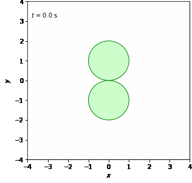

#Temporary Result (28March)

To see illustrations<a href="https://docs.google.com/document/d/1sPUEbgdDKk0lN3tvGKjdI0X0MHleW4hW2XIJrxzFCg0/edit?usp=sharing" target="_blank"> click here</a>

<table style="width:100%">
  <tr>
    <td>
        
        
 Motionless

    </td>
    <td>
        
        
 X-axis Translation

    </td>
    <td>
        
        
 Y-axis Translation

    </td>
    <td>
        
        
 Z-axis Translation

    </td>
    <td>
        
        
 X-axis Translation with perspective

    </td>
  </tr>
  <tr>
    <td>1</td>
    <td>Motionless</td>
    <td></td>
  </tr>
  <tr>
    <td>Centro comercial Moctezuma</td>
    <td>Francisco Chang</td>
    <td>Mexico</td>
  </tr>
</table>