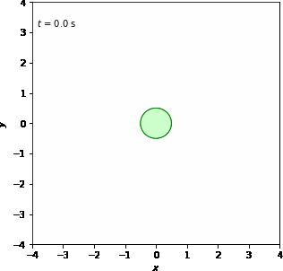
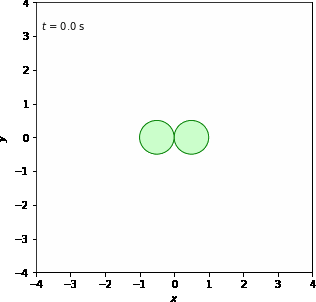
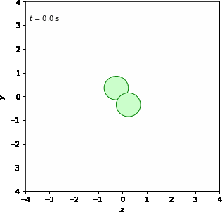

# Temporary Result 15/64

To see illustrations<a href="https://docs.google.com/document/d/1sPUEbgdDKk0lN3tvGKjdI0X0MHleW4hW2XIJrxzFCg0/edit?usp=sharing" target="_blank"> click here</a>

<table>
    <tr>
        <td>
             
            
            
 X-axis Translational X-axis Rotational

        </td>
        <td>
             
            
            
 X-axis Translational Y-axis Rotational

        </td>
        <td>
             
            
            
 X-axis Translational XYZ-axis Rotational

        </td>
    </tr>
    <tr>
        <td>
             
            
            
 Y-axis Translational XYZ-axis Rotational

        </td>
        <td>
             
            
            
 Z-axis Translational XYZ-axis Rotational

        </td>
        <td>
             
            
            
 Z-axis Translational XYZ-axis Rotational wit perpective

        </td>
    </tr> 
</table>